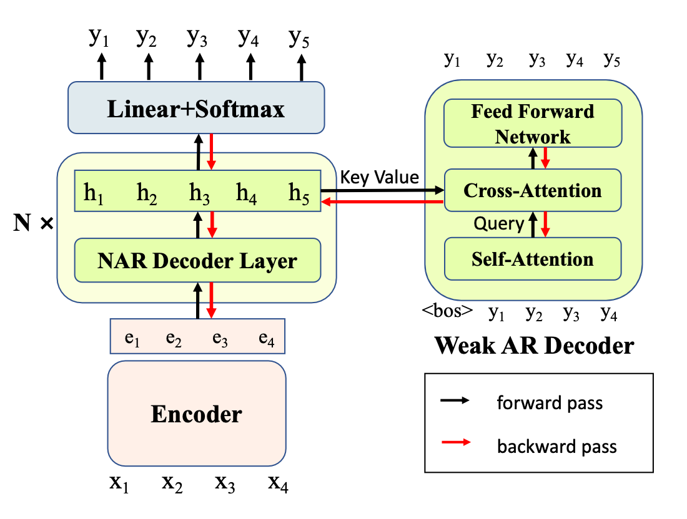

Implementation for the EMNLP2022 paper "**Helping the Weak Makes You Strong: Simple Multi-Task Learning Improves Non-Autoregressive Translators.**"
.

## Model Architecture



We propose a simple multi-task learning framework that introduces auxiliary weak AR decoders to make NAR models stronger. The AR decoders are as weak as possible, so they can not model the target sequence on their own unless the knowledge provided by the NAR decoder is sufficiently useful. Therefore, the NAR model has to become stronger to support AR decoders.

Our framework is plug-and-play and model-agnostic, so you can easily add a new NAR model to our multi-task framework. The "multitasknat" folder contains examples of CTC-based NAR model and vanilla NAR model. 

## Requirements & Installations

- Python >= 3.7
- Pytorch >= 1.11.0

```
git clone https://github.com/wxy-nlp/MultiTaskNAT.git && cd MultiTaskNAT && pip install -e .
```

## Training and Running

We integrate the training and running pipeline in an bash file in the "run" folder. You can change the variable 